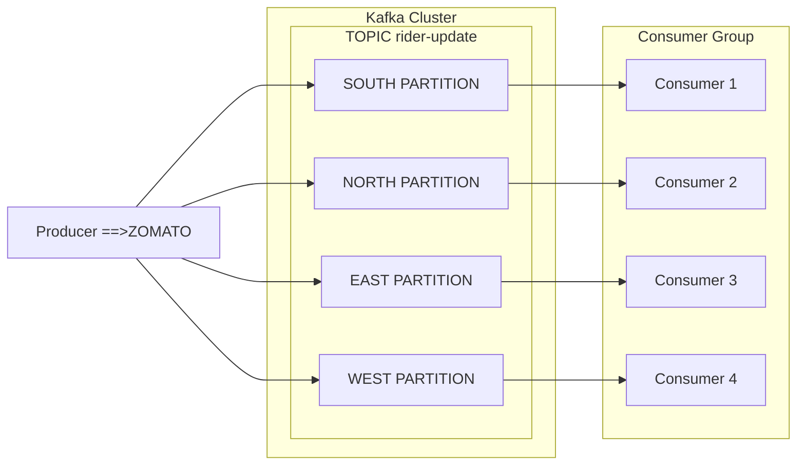

## Types of Communication

### Synchronous (Strong coupling- Real Time Communication)
1. HTTP (REST/GraphQL)
2. Websocket (Debatable if sync or async)

### Asynchronous (Weak Coupling- Not Happened in realtime)
1. Messaging queues
2. Pub subs
3. Server-Side Events
4. Websocket (Debatable)(The initial handshake is synchronous, using HTTP to establish the connection; however, once established, data transmission is handled asynchronously)


## Harikat-Leetcode-system-design


### my thoughts on leetcode

LeetCode uses HTTP(**polling**- means asking from server again and again that if my submission done) instead of WebSockets primarily for cost savings. If LeetCode were to use WebSockets, their primary server would need to be scaled up to handle a high volume of WebSocket connections from browsers. Additionally, they would need to scale their worker servers to match. Essentially, they opt for polling to avoid the higher costs associated with scaling WebSocket infrastructure.

### REDIS - It's an open-source, in-memory data structure used as a database, cache, and message broker.


**Scenario**: Your application has a high-traffic endpoint like `/track` that retrieves tracking information from PostgreSQL. When 1000 requests hit this endpoint, the load on your PostgreSQL database increases significantly, potentially leading to performance issues.

**Solution**: Cache the results of `/track` in Redis to reduce the load on PostgreSQL and speed up response times.


### Caching with Redis for Endpoint `/track`

1. **Request Handling:**
   - **Check Redis:** Look up `/track` data in Redis first.
   - **If Cached:** Return data from Redis, avoiding PostgreSQL.
   - **If Not Cached:** Query PostgreSQL for data.

2. **Caching Result:**
   - Store the data from PostgreSQL in Redis with an expiration time (TTL).

3. **Cache Invalidation:**
   - Use TTLs or update mechanisms to invalidate the cache when data changes.


### Q. what if admin update the /track. so first  clear the redis cache. then write updated data to postgres

### Q. Since Redis is an in-memory database, what happens if it goes down or if the process is terminated? How can the risk of data loss be mitigated?
- **RDB (Redis Database Backup)**: Redis can take periodic snapshots (like 1hr) of your data and save them to disk.
- **AOF (Append Only File):**  Redis writes every action (like adding or changing data) to a log file. This log file is saved on disk and can be used to rebuild the data if Redis restarts.
- **No persistence:** You can disable persistence completely. This is sometimes used when caching.
- **RDB + AOF:** You can also combine both AOF and RDB in the same instance. With this setup, you can configure Redis to create RDB snapshots (backups) at regular intervals (e.g., every hour). If data is lost between these snapshots, the AOF log will have a record of all changes since the last snapshot. 


Where are queue stored ? ====>  Redis, RabbitMQ

### REDIS:
**DOCS:** [Lists-data-types(LPUSH----->RPOP,BLPOP....etc)](https://redis.io/docs/latest/develop/data-types/lists/)
Also use `redis-cli` to connect to server.

### To Store a JSON Object on the Left Side of a **List** Named **QUEUE**
```bash
LPUSH QUEUE '{ "name": "Saurabh", "age": 23 }'
```

### How Does it look like


### To run redis-stack using Docker
```sh
 docker run -d --name redis-stack -p 6379:6379 -p 8001:8001 redis/redis-stack:latest 
```

## Apache Kafka

KAFKA SERVER
   |
   |__ TOPIC- Represents Logical grouping of message eg. rider-update,hotel-update===> Producers publish messages to a topic based on their needs, and consumers subscribe to topics.
         |
         |__ PARTITION- to divide in smaller chunks allow for parallel processing and scalability. . like we use geographic location, north,south to distribute data more efficiently.  

- rabbitMQ, SQS as well as redis uses ====> Queue(data-structure first-in-first-out(FIFO))
- kafka uses consumer groups. [consumber-group-blog](https://medium.com/javarevisited/kafka-partitions-and-consumer-groups-in-6-mins-9e0e336c6c00)
- Apache Kafka act as pub/sub but also act as a queue. using consumer group.
  
Kafka can emulate queue-like behavior using consumer groups. For instance, if you have a topic with 4 partitions and create a consumer group with 4 consumers, each consumer will be assigned to a specific partition. This setup ensures that each message in a partition is processed by only one consumer, similar to how a traditional queue distributes tasks among workers.



